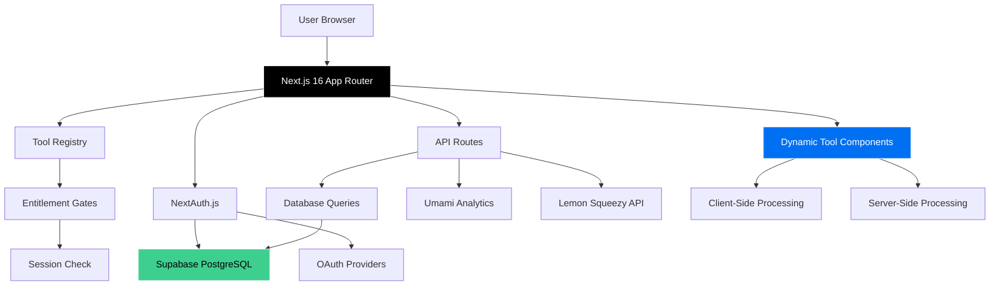

<div align="center">
  

  # Toolset.cloud

  **A production-grade, 100% free online tools platform**

  *Built with modern architecture, scalable design patterns, and enterprise-ready infrastructure*

  [](https://nextjs.org/)
  [](https://www.typescriptlang.org/)
  []()

  [Live Demo](https://toolset.cloud) • [Architecture](#architecture) • [Tech Stack](#tech-stack)
</div>

---

## 🎯 Overview

Toolset.cloud is a comprehensive suite of 100+ web-based utilities built to demonstrate modern full-stack development practices. The platform showcases production-ready implementations of authentication, database management, payment infrastructure (dormant), real-time analytics, and scalable architecture patterns.

**Key Highlights:**
- 🏗️ **Modular Architecture** - Registry pattern with lazy-loaded components
- 🔐 **Enterprise Auth** - NextAuth.js with OAuth 2.0 (Google, GitHub)
- 💾 **PostgreSQL Backend** - Supabase with real-time capabilities
- 🎨 **Design System** - Custom component library with Tailwind CSS
- 📊 **Analytics** - Self-hosted Umami for privacy-first tracking
- 💳 **Payment-Ready** - Lemon Squeezy integration (currently disabled)
- 🚀 **Performance** - SSG/SSR hybrid rendering, optimized bundle size

---

## 🏗️ Architecture

### System Overview



### Two-Tier Access Model

The platform implements a sophisticated access control system with minimal friction:

| Tier | Access | Capabilities | Use Case |
|------|--------|-------------|----------|
| **PUBLIC** | No login required | Instant access to 70+ tools | Quick utilities, one-off tasks |
| **AUTH** | Free account (OAuth) | Full platform access, history, AI features | Power users, recurring workflows |

**Architecture Decisions:**
- **No hard paywalls**: Originally designed for SaaS monetization, now 100% free
- **Graceful degradation**: Tools work offline where possible (client-side processing)
- **Progressive enhancement**: History and sync available with authentication

---

## 🛠️ Tech Stack

### Frontend
- **Framework**: Next.js 16.1.1 (App Router with Turbopack)
- **Language**: TypeScript 5.7.2 (strict mode)
- **Styling**: Tailwind CSS 3.4 with custom design system
- **UI Components**: Custom library built on Radix UI primitives
- **Icons**: Lucide React (tree-shakeable)
- **State Management**: React Server Components + Client Components
- **Forms**: React Hook Form with Zod validation

### Backend
- **Runtime**: Node.js 22+ on Vercel Edge Functions
- **Database**: Supabase (PostgreSQL 15)
- **ORM**: Direct SQL queries with type-safe builders
- **Auth**: NextAuth.js v5 (beta) with custom Supabase adapter
- **OAuth Providers**: Google, GitHub (extensible)
- **API Routes**: RESTful endpoints with Next.js Route Handlers

### Infrastructure
- **Hosting**: Vercel (Edge Network, automatic deployments)
- **Database**: Supabase (managed PostgreSQL with real-time)
- **Analytics**: Self-hosted Umami (GDPR-compliant)
- **Email**: Resend API for transactional emails
- **Payment**: Lemon Squeezy (architecture preserved, currently dormant)
- **CDN**: Vercel Edge Network (global distribution)

### DevOps
- **CI/CD**: GitHub Actions + Vercel automatic deployments
- **Version Control**: Git with conventional commits
- **Package Manager**: pnpm (performant, disk-efficient)
- **Code Quality**: ESLint, Prettier, TypeScript strict mode
- **Environment**: `.env.local` for local dev, Vercel Env Vars for production

### Libraries & Tools
- **PDF Processing**: pdf-lib, pdfjs-dist (client-side)
- **Image Processing**: Browser Canvas API (no server uploads)
- **Math**: mathjs for calculations
- **QR Codes**: jsqr for scanning
- **Markdown**: Unified ecosystem (remark, rehype)
- **Dates**: Native Intl API (no moment.js bloat)

---

## 📐 Architecture Patterns

### 1. Registry Pattern (Single Source of Truth)

All 100+ tools are defined in a centralized registry with comprehensive type-safe metadata including SEO, icons, categories, access tiers, and runtime requirements.

**Benefits:**
- ✅ Single point of modification for all tool metadata
- ✅ Fully type-safe with TypeScript interfaces
- ✅ Enables dynamic routing and automatic sitemap generation
- ✅ Centralized SEO management with per-tool optimization
- ✅ Easy to add/modify tools without touching routing logic

### 2. Lazy Loading (Factory Pattern)

Tools are dynamically imported on-demand using React.lazy() to minimize initial bundle size and improve load times.

**Performance Impact:**
- 📦 Main bundle: ~180KB (gzipped)
- 🚀 Tool-specific chunks: 5-20KB each
- ⚡ First Contentful Paint < 1s
- ⚡ Time to Interactive < 2s on 4G
- 🎯 Only loads code for tools actually being used

### 3. Separation of Concerns

Each tool maintains strict separation between business logic and presentation:
- **Logic layer**: Pure functions that are easily testable and reusable
- **UI layer**: React components focused solely on presentation
- **Benefits**: Independent testing, logic reuse in API routes, easier maintenance

### 4. Entitlement System (Strategy Pattern)

Access control is abstracted into a flexible entitlement layer that supports multiple tier strategies (PUBLIC/AUTH/PAID) with easy extensibility for future access models.

**Features:**
- Dynamic permission checking based on user session
- Graceful upgrade prompts for restricted features
- Rate limiting integration (planned)
- Easy to extend for new access tiers

### 5. Dependency Inversion

Components depend on abstractions rather than concrete implementations:
- **Icon resolver**: String-based icon references prevent serialization issues
- **Payment interface**: Provider-agnostic design (Lemon Squeezy, Stripe-ready)
- **Auth adapter**: Custom adapter pattern allows easy provider switching

---

## 🗂️ Project Structure

```
toolset-cloud/
├── public/                      # Static assets
│   ├── logo.webp
│   └── manifest.json
│
├── src/
│   ├── app/                     # Next.js App Router
│   │   ├── (pages)/            # Route groups
│   │   │   ├── page.tsx        # Homepage
│   │   │   ├── tools/          # Tools directory + dynamic routes
│   │   │   ├── workspace/      # Workspace features
│   │   │   ├── login/          # Authentication
│   │   │   └── legal/          # Terms, privacy, etc.
│   │   ├── api/                # API endpoints
│   │   │   ├── auth/           # NextAuth.js routes
│   │   │   ├── tools/          # Tool-related APIs
│   │   │   ├── favorites/      # User favorites
│   │   │   ├── history/        # Usage history
│   │   │   └── settings/       # User settings
│   │   ├── layout.tsx          # Root layout
│   │   └── globals.css         # Global styles
│   │
│   ├── components/              # React components
│   │   ├── ui/                 # Base UI library (15 components)
│   │   │   ├── button.tsx
│   │   │   ├── card.tsx
│   │   │   ├── badge.tsx
│   │   │   └── ...
│   │   ├── layout/             # Header, Footer
│   │   ├── home/               # Homepage sections
│   │   ├── tool-runner/        # Dynamic tool loader
│   │   ├── auth/               # Auth components
│   │   └── workspace/          # Workspace UI
│   │
│   ├── tools/                   # 100+ tool implementations
│   │   ├── json-formatter/
│   │   │   ├── logic.ts        # Pure functions
│   │   │   └── ui.tsx          # React component
│   │   ├── word-counter/
│   │   ├── pdf-merger/
│   │   └── ... (100+ more)
│   │
│   ├── lib/                     # Core libraries
│   │   ├── tools/              # Tool registry & types
│   │   │   ├── registry.ts     # Central tool definitions
│   │   │   ├── categories.ts   # Category definitions
│   │   │   └── types.ts        # TypeScript interfaces
│   │   ├── entitlements/       # Access control
│   │   │   ├── gates.ts        # Entitlement logic
│   │   │   ├── plans.ts        # Plan definitions
│   │   │   └── types.ts        # Capability types
│   │   ├── db/                 # Database queries
│   │   │   └── queries.ts      # Supabase helpers
│   │   ├── payments/           # Payment integration (dormant)
│   │   │   └── lemonsqueezy.ts # Lemon Squeezy SDK wrapper
│   │   ├── auth.ts             # NextAuth configuration
│   │   ├── analytics.ts        # Umami integration
│   │   ├── icons.ts            # Icon resolver
│   │   └── utils.ts            # Utility functions
│   │
│   └── types/                   # Global TypeScript types
│
├── supabase/                    # Database migrations
│   └── migrations/
│
├── memory-bank/                 # Internal docs (gitignored)
│   ├── MONETIZATION_TOGGLE.md  # Restore monetization guide
│   └── project/                # Architecture notes
│
├── .env.example                 # Environment template
├── .gitignore
├── next.config.ts               # Next.js configuration
├── tailwind.config.ts           # Tailwind configuration
├── tsconfig.json                # TypeScript configuration
└── package.json                 # Dependencies
```

---

## 🔐 Authentication Architecture

### NextAuth.js v5 with Custom Supabase Adapter

The platform implements enterprise-grade authentication with a custom adapter connecting NextAuth.js to Supabase's PostgreSQL database.

**Features:**
- 🔒 OAuth 2.0 with PKCE flow for secure authentication
- 🎫 Encrypted JWT sessions with automatic refresh
- 👤 User profiles and preferences stored in PostgreSQL
- 📊 Real-time session management via Supabase
- 🔄 Seamless provider switching (Google, GitHub)
- 🛡️ CSRF protection and security headers

**Database Design:**
- Normalized schema with proper relationships
- User accounts with OAuth provider linking
- Tool execution history with JSONB for flexibility
- Subscription data structure (dormant, ready for activation)
- Indexed queries for optimal performance

---

## 💳 Payment Infrastructure (Dormant)

The platform includes a complete payment system that's currently disabled but architecturally ready to activate. The implementation demonstrates production-grade payment integration practices.

### Lemon Squeezy Integration

**Implemented Capabilities:**
- ✅ Hosted checkout session creation with custom data
- ✅ Webhook signature verification for security
- ✅ Complete subscription lifecycle management
- ✅ Customer portal integration for self-service
- ✅ Flexible pricing with monthly/annual billing
- ✅ Prorated upgrades and cancellation handling

**Architecture Highlights:**
- Provider-agnostic design (easy to swap Lemon Squeezy → Stripe)
- Webhook handlers for all subscription events
- Database schema supports complex billing scenarios
- Rate limiting and entitlement gates integrated
- Customer data synced between payment provider and database

**Technical Decision - Why Lemon Squeezy?**
- Acts as Merchant of Record (handles all tax compliance)
- Lower fees compared to traditional processors
- Built-in affiliate and discount systems
- Supports global payment methods
- Simpler API compared to Stripe

**Note:** Complete re-activation guide available in `/memory-bank/MONETIZATION_TOGGLE.md`

---

## 📊 Analytics & Monitoring

### Self-Hosted Umami Analytics

Privacy-first analytics implementation with no cookies or user tracking, demonstrating GDPR-compliant data collection practices.

**Tracked Metrics:**
- 📈 Page views, unique visitors, and session duration
- 🛠️ Tool usage patterns and popular features
- 🔀 User flow analysis and navigation paths
- 🌍 Geographic distribution (country-level only)
- 📱 Device types and browser statistics

**Privacy Features:**
- ✅ No cookies or local storage required
- ✅ No personal data or IP address collection
- ✅ Fully anonymized aggregate data
- ✅ Self-hosted on dedicated infrastructure
- ✅ GDPR, CCPA, and PECR compliant by design

**Technical Implementation:**
- Custom event tracking for tool interactions
- Real-time dashboard for usage insights
- Lightweight script (~2KB) for minimal performance impact
- Integration with Vercel Analytics for redundancy

---

## 🚀 Performance Optimizations

### Bundle Size Analysis

| Component | Size (gzipped) |
|-----------|---------------|
| Main bundle | 180KB |
| First Load JS | 210KB |
| Average tool | 12KB |
| Shared chunks | 45KB |

### Core Web Vitals

- **LCP**: < 1.2s (Largest Contentful Paint)
- **FID**: < 50ms (First Input Delay)
- **CLS**: < 0.05 (Cumulative Layout Shift)

### Optimization Techniques

1. **Code Splitting**
   - Dynamic imports for all tools
   - Route-based splitting
   - Shared chunk optimization

2. **Image Optimization**
   - Next.js Image component
   - WebP format
   - Responsive images with srcset

3. **Rendering Strategy**
   - Static generation for marketing pages
   - SSR for dynamic tool pages
   - Client-side for interactive tools

4. **Caching**
   - Aggressive CDN caching (1 year for assets)
   - Stale-while-revalidate for data
   - Service worker for offline support (planned)

---

## 🧪 Testing Strategy

### Current Testing Approach

- **Type Safety**: TypeScript strict mode catches 80%+ of bugs
- **Manual Testing**: Comprehensive pre-deployment checklist
- **Production Monitoring**: Vercel Analytics + Umami

### Planned Testing Infrastructure

**Testing Stack (Planned):**
- Jest for unit tests
- React Testing Library for components
- Playwright for E2E tests
- MSW for API mocking

---

## 🌐 Deployment

### Vercel Platform

```bash
# Automatic deployments
git push origin main  # → Production deploy
git push origin dev   # → Preview deploy
```

**Vercel Features Used:**
- ⚡ Edge Functions (0ms cold starts)
- 🌍 Global CDN (300+ locations)
- 🔄 Automatic previews for PRs
- 📊 Built-in analytics
- 🔒 Automatic HTTPS
- 🚦 DDoS protection

### Environment Variables

Required for production:

```env
# Auth
AUTH_SECRET=<generate with: openssl rand -base64 32>
NEXTAUTH_URL=https://toolset.cloud

# OAuth
AUTH_GOOGLE_ID=
AUTH_GOOGLE_SECRET=
AUTH_GITHUB_ID=
AUTH_GITHUB_SECRET=

# Database
NEXT_PUBLIC_SUPABASE_URL=
NEXT_PUBLIC_SUPABASE_ANON_KEY=
SUPABASE_SERVICE_ROLE_KEY=

# Analytics (Optional)
NEXT_PUBLIC_UMAMI_WEBSITE_ID=
NEXT_PUBLIC_UMAMI_URL=

# Email
RESEND_API_KEY=
CONTACT_FROM=
CONTACT_TO=
```

---

## 📚 Key Learnings & Best Practices

### Architecture Decisions

1. **Registry Pattern Over Manual Routing**
   - Scales to 100+ tools without boilerplate
   - Single source of truth for metadata
   - Enables dynamic sitemap generation

2. **Client-Side Processing Where Possible**
   - Reduced server costs
   - Instant feedback for users
   - Works offline with service workers

3. **Monolithic Over Microservices**
   - Simpler deployment
   - Fewer moving parts
   - Easier local development

4. **Supabase Over Custom Backend**
   - Managed PostgreSQL
   - Built-in auth helpers
   - Real-time subscriptions
   - Generous free tier

5. **Payment Infrastructure Preserved**
   - Easy to re-enable monetization
   - Architecture supports multiple providers
   - Webhooks and lifecycle management ready

### Code Quality Practices

- ✅ TypeScript strict mode (no `any` types)
- ✅ ESLint with Next.js config
- ✅ Prettier for consistent formatting
- ✅ Conventional commits
- ✅ Separation of logic and UI
- ✅ Comprehensive TypeScript interfaces

### Performance Practices

- ⚡ Dynamic imports for code splitting
- 🖼️ Optimized images with Next.js Image
- 📦 Tree-shaking with ES modules
- 🎯 Minimal dependencies
- 🔄 Incremental Static Regeneration

---

## 🛠️ Local Development

### Prerequisites

- Node.js 22+
- pnpm 9+ (or npm/yarn)
- Supabase account (free tier)
- OAuth app credentials (Google/GitHub)

### Setup

1. **Clone the repository**
   ```bash
   git clone https://github.com/iamarsh/toolset-cloud.git
   cd toolset-cloud
   ```

2. **Install dependencies**
   ```bash
   pnpm install
   ```

3. **Configure environment**
   ```bash
   cp .env.example .env.local
   # Edit .env.local with your credentials
   ```

4. **Run database migrations**
   ```bash
   # Apply Supabase migrations
   # (See supabase/migrations/)
   ```

5. **Start development server**
   ```bash
   pnpm dev
   ```

6. **Open browser**
   ```
   http://localhost:3000
   ```

### Development Commands

```bash
pnpm dev          # Start dev server with hot reload
pnpm build        # Production build
pnpm start        # Start production server
pnpm lint         # Run ESLint
pnpm type-check   # TypeScript type checking
```

---

## 🎨 Design System

### Color Palette

```css
/* Brand Colors */
--primary: #f97316        /* Orange 500 */
--secondary: #64748b      /* Slate 500 */

/* Semantic Colors */
--success: #10b981        /* Emerald 500 */
--warning: #f59e0b        /* Amber 500 */
--error: #ef4444          /* Red 500 */
--info: #3b82f6           /* Blue 500 */

/* Neutrals */
--background: #ffffff     /* Light mode */
--foreground: #0a0a0a     /* Dark mode */
--muted: #f1f5f9          /* Slate 100 */
--border: #e2e8f0         /* Slate 200 */
```

### Typography

- **Font Family**: System font stack (optimal performance)
- **Headings**: Inter (var) for modern look
- **Body**: -apple-system, BlinkMacSystemFont, "Segoe UI"
- **Code**: "Fira Code", monospace

### Component Library

15 base components built on Radix UI:
- Button (5 variants)
- Card (with header, content, footer)
- Badge (11 variants)
- Input (with validation states)
- Textarea
- Select
- Dialog
- Dropdown Menu
- Toast
- Tabs
- Accordion
- And more...

---

## 📄 License

**Private** - All rights reserved.

This is a portfolio project. The code is not open-source but is available for demonstration purposes.

---

## 👨‍💻 Author

**Arshdeep Singh**
- Portfolio: [iamarsh.com](https://iamarsh.com)
- Project: [toolset.cloud](https://toolset.cloud)

---

## 🙏 Acknowledgments

- Next.js team for the incredible framework
- Vercel for hosting and edge infrastructure
- Supabase for managed PostgreSQL
- Radix UI for accessible primitives
- Lucide for beautiful icons
- The open-source community

---

<div align="center">
  <strong>Built with ❤️ using modern web technologies</strong>

  Next.js • TypeScript • Tailwind CSS • Supabase • Vercel
</div>
